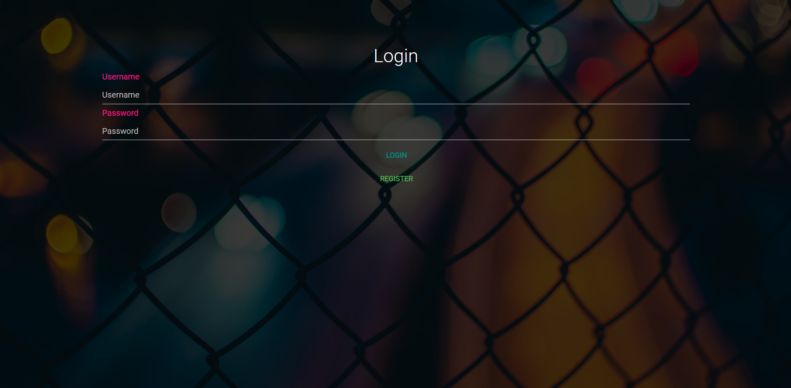
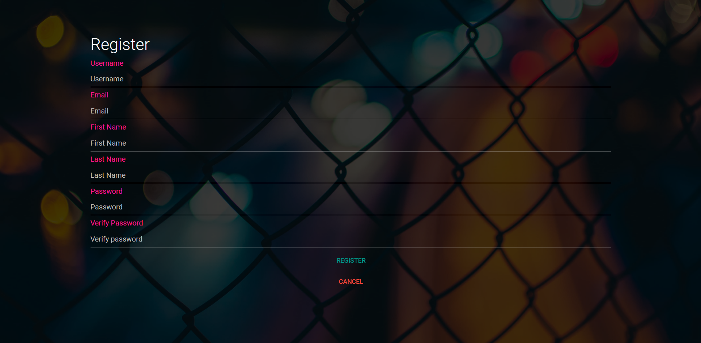
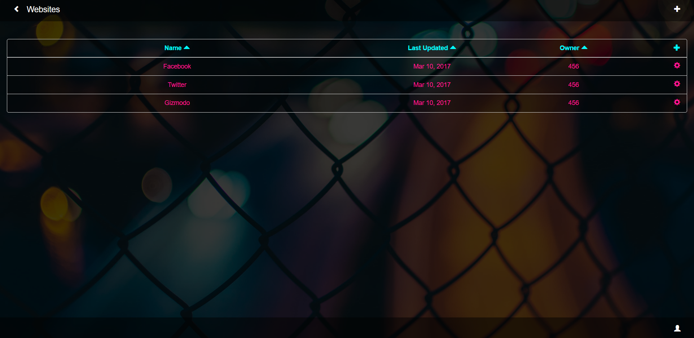
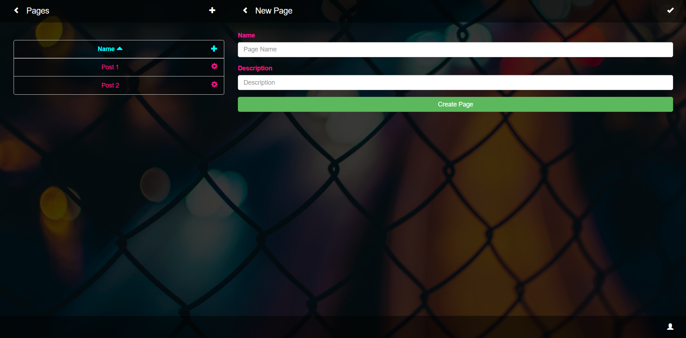
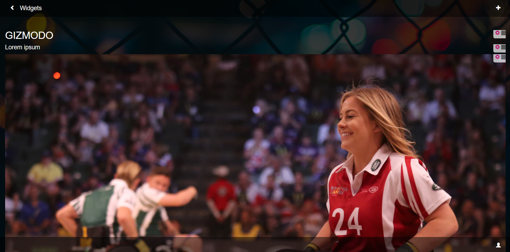
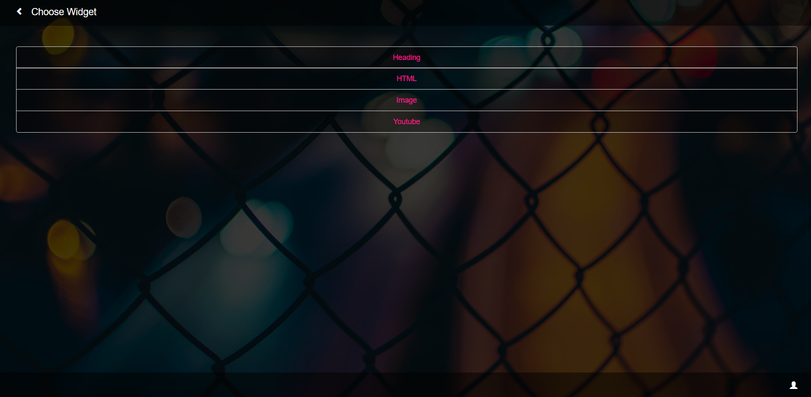

# Website Maker
## Introduction
A web app being developed as part of CS5610 that allows users to create and use online, mobile-friendly websites. The website is built using MEAN stack using the four underpinning technologies – MongoDB, Express, AngularJS and Node.js

## Screenshots

## Bugs and Feedback
For bugs, questions and discussions please use the [Github Issues](https://github.com/aksh4y/sadarangani-akshay-webdev/issues).
